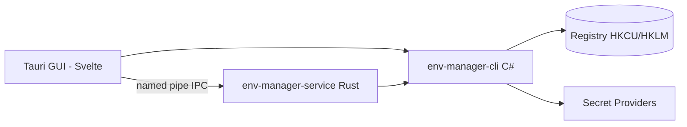

<div align="center">

<picture>
  <source media="(prefers-color-scheme: dark)" srcset="docs/assets/logo-dark-theme.png">
  <source media="(prefers-color-scheme: light)" srcset="docs/assets/logo-light-theme.png">
  
</picture>

<p align="center">
  
</p>

# Env Manager

A modern, lightweight **Windows environment-variable manager** — CLI and GUI dual-mode, inspired by Microsoft PowerToys but standalone and agent-friendly.

**"Adapts seamlessly to every environment."**

[](https://github.com/Xxx91n/env-manager/releases)
[](LICENSE)
[](#install)
[](#prerequisites)
[](#architecture)

[Install](#install) · [Features](#features) · [CLI Reference](docs/cli-commands.md) · [Architecture](#architecture) · [Changelog](CHANGELOG.md)

<!-- README-I18N:START -->
**Languages:** **English** · [简体中文](docs/i18n/README.zh_CN.md) · [日本語](docs/i18n/README.ja.md) · [한국어](docs/i18n/README.ko.md) · [Deutsch](docs/i18n/README.de.md) · [Français](docs/i18n/README.fr.md) · [Español](docs/i18n/README.es.md) · [Português](docs/i18n/README.pt.md) · [Русский](docs/i18n/README.ru.md) · [العربية](docs/i18n/README.ar.md)
<!-- README-I18N:END -->

</div>

<p align="center">
  
</p>

## Demos

<p align="center">
  
</p>

The demo shows read-only CLI commands in action: `agents --summary`, `path health`, `get PATH`, and `agents --json`. Regenerate with `vhs docs/assets/demo.tape`.

## Features

- **Agent-native CLI** — 18+ commands with a first-class machine contract: `env-manager-cli agents --json` exposes a structured command spec, and every capability is documented in an agent-facing manual ([AGENTS.cli.md](AGENTS.cli.md)) that ships with the binary.
- **Profiles & config** — Global profiles apply to the registry; Launch profiles inject an isolated env block into a single process (never touch the registry, never broadcast `WM_SETTINGCHANGE`). Inheritance, conflict previews, and safe reverse-order rollback included. Launch targets inside the Windows system folder (`System32`) are refused at profile save/launch to prevent system32 hijacking. Preflight validation is two-tier: suspicious-but-safe findings (undefined %VAR%, stale PATH entries, dangling launch targets) warn with exit code 2 instead of blocking; `--strict` escalates.
- **8 secret providers, zero plaintext** — DPAPI, Credential Manager, SecretStore, HashiCorp Vault, SOPS, Azure Key Vault, 1Password, AWS Secrets Manager. Plaintext never persists to disk or logs.
- **Protected by default** — system variables and PATH entries cannot be deleted or renamed; every write is a three-layer serialized contract (mutex + write lock + verify-before-swap).
- **PATH health** — detects duplicates and dead entries, with `--fix` / `--dry-run`.
- **Audit ledger** — append-only, SHA256 hash-chained history with rollback and disaster-recovery export.
- **CLI + GUI dual-mode** — C# CLI for scripting/CI; native Tauri 2 + Svelte GUI for interactive editing. Both route through the same registry contracts. 10-language i18n.

## For AI Agents

Env Manager is designed to be operated by LLM agents, not just humans:

```bash
env-manager-cli agents            # print the embedded agent manual
env-manager-cli agents --path     # file path of the manual (AGENTS.cli.md)
env-manager-cli agents --summary  # one-line machine-readable spec
env-manager-cli agents --json     # full command table as structured JSON
```

- [AGENTS.md](AGENTS.md) — repository-level agent instructions (architecture, hard boundaries, testing).
- [AGENTS.cli.md](AGENTS.cli.md) — shipped with the CLI binary so any agent can discover the contract at runtime.
- **Capability-scoped agentic surface** — opt-in `agentCapabilities` whitelist on `secret-providers.json` lets deployments reject parallel set/delete calls from agents.

## Security

> [!WARNING]
> Current builds are **not code-signed**. Windows SmartScreen may show an "unrecognized app" warning on first launch — click "More info" then "Run anyway". We have applied for free open-source code signing via the SignPath Foundation; once approved, all release artifacts (MSI + EXE) will be signed. See [Code signing policy](docs/code-signing-policy.md).

Protected variables and PATH entries are disabled before deletion, with exact registry value-kind verification on restore. Secret values are encrypted via provider-specific mechanisms — plaintext never persists to disk or logs. Named pipe IPC uses anti-squatting flags and input validation (64 arg max, 32767 char cap, null byte rejection). See [SECURITY.md](SECURITY.md) for vulnerability reporting.

## Install

### MSI Installer

Download the MSI from [GitHub Releases](https://github.com/Xxx91n/env-manager/releases) and run it. Creates Start Menu shortcuts automatically. Available in x64, x86, and ARM64.

### Portable

Download the portable ZIP from [GitHub Releases](https://github.com/Xxx91n/env-manager/releases). Extract and run `env-manager.exe` directly. No installation needed.

### CLI-Only

Download the CLI-only ZIP for headless or scripting use: `env-manager-cli.exe` plus `.dll` files. No GUI, no WebView2 dependency.

### Prerequisites

> [!IMPORTANT]
> **Portable** and **CLI-Only** builds are framework-dependent: they require the **.NET 10 Desktop Runtime** on the target machine — download it from the official [.NET download page](https://dotnet.microsoft.com/download/dotnet/10.0). The **MSI installer** checks for .NET 10 at install time and prompts automatically.
>
> **WebView2 Runtime** (for the GUI) is preinstalled on Windows 11 and available for Windows 10 21H2+ from [Microsoft](https://developer.microsoft.com/microsoft-edge/webview/).

For optional external secret-provider tools (SOPS, 1Password CLI, Vault CLI, AWS CLI, Azure CLI, PowerShell 7), see the [Secret Providers Guide](docs/secret-providers-guide.md).

### winget

> [!NOTE]
> winget distribution is planned but not yet available. Track via GitHub Issues for updates.

### From Source

```bash
git clone https://github.com/Xxx91n/env-manager.git
cd env-manager
cd frontend && npm ci && cd ..
node scripts/build.mjs --arch x64
```

Requires .NET 10 SDK, Node.js 20+, Rust stable with MSVC target. See [docs/build-and-release.md](docs/build-and-release.md) for details.

## Usage

### CLI

```bash
# List / get / set
env-manager-cli.exe list
env-manager-cli.exe get PATH
env-manager-cli.exe set JAVA_HOME "D:\jdk17" --scope system

# Create a Launch profile and launch with isolated env
env-manager-cli.exe profile create dev --type launch --target python.exe
env-manager-cli.exe profile add-secret dev API_KEY "sk-xxx"
env-manager-cli.exe profile launch dev

# PATH health
env-manager-cli.exe path health

# Backup / restore
env-manager-cli.exe backup --output backup.json
env-manager-cli.exe restore backup.json

# Disaster recovery + tamper-evident audit
env-manager-cli.exe export-state --output state.dpapi
env-manager-cli.exe audit verify-ledger

# Service control
env-manager-cli.exe service status
```

See [docs/cli-commands.md](docs/cli-commands.md) for the full command reference.

### GUI

Run `env-manager.exe`. The GUI provides a real-time variable list with search, scope filtering, inline edit, a PATH editor with drag-and-drop reordering, profile management, secret provider selection, service control panel, audit history, and 10-language i18n.

## Architecture



- **CLI**: C# .NET 10 single-file executable — the coordination layer and registry gateway.
- **Service**: standalone Rust binary managing secret mount lifecycle via named pipe IPC.
- **GUI**: Tauri 2 + Svelte 4 frontend using the same IPC contracts.

## Secret Providers

8 provider backends with activation preflight — failures surface as inline amber banners directly in the profile editor:

| Provider | Auth Method | Periodic Refresh | Docs |
|---|---|---|---|
| DPAPI CurrentUser | Windows DPAPI | No (per-user) | [Guide](docs/secret-providers-guide.md) |
| Windows Credential Manager | CredMan + DPAPI | No (per-user) | [Guide](docs/secret-providers-guide.md) |
| PowerShell SecretManagement | SecretStore vault | Best-effort | [Guide](docs/secret-providers-guide.md) |
| HashiCorp Vault KV v2 | VAULT_TOKEN / AppRole cert | Yes | [Guide](docs/secret-providers-guide.md) |
| SOPS | Age / PGP / KMS | Yes | [Guide](docs/secret-providers-guide.md) |
| Azure Key Vault | SP cert / managed identity | Yes | [Guide](docs/secret-providers-guide.md) |
| 1Password CLI | OP_SERVICE_ACCOUNT_TOKEN | Yes | [Guide](docs/secret-providers-guide.md) |
| AWS Secrets Manager | SigV4 + access keys | Yes | [Guide](docs/secret-providers-guide.md) |

See [docs/secret-providers-guide.md](docs/secret-providers-guide.md) for per-provider prerequisites, one-time setup, and activation error fix steps.

## Service Mode

`env-manager-service.exe` is a standalone Rust binary managing secret mount lifecycle via named pipe IPC:

- **RuntimeMode**: Service (SCM-managed, machine boot), Background (user-launched), Cli (one-shot gateway)
- **Reconcile loop**: 300s periodic full-scan, idempotent per-item handler, 30s first-tick delay
- **Cert bootstrap**: Vault AppRole and Azure SP certificate-based auth eliminates long-lived tokens
- **Audit ledger**: append-only hash-chained `audit-ledger.jsonl` with 100MB rotation and tamper detection
- **IPC**: anti-squatting pipe flag, 65536-byte request cap, newline-delimited JSON protocol
- **Watchdog**: two-layer recovery — SCM auto-restart (Service mode) + GUI 30s ping watchdog (Background mode)

## Documentation

| Document | Content |
|---|---|
| [CHANGELOG.md](CHANGELOG.md) | Version history (keepachangelog format) |
| [docs/cli-commands.md](docs/cli-commands.md) | Full CLI command reference |
| [docs/architecture.md](docs/architecture.md) | Deep architecture |
| [docs/backup-and-profiles.md](docs/backup-and-profiles.md) | Backup, restore, profile semantics |
| [docs/secret-providers-guide.md](docs/secret-providers-guide.md) | Secret provider setup |
| [docs/build-and-release.md](docs/build-and-release.md) | Build and release process |
| [docs/adr/](docs/adr/) | Architecture decision records |
| [AGENTS.md](AGENTS.md) / [AGENTS.cli.md](AGENTS.cli.md) | Agent-facing guides |

## Maintainers

[@Xxx91n](https://github.com/Xxx91n)

## Releasing

Releases run on the release-please single track: land conventional commits on main, review & merge the automated `chore(main): release X.Y.Z` PR, and the `vX.Y.Z` tag triggers the full artifact pipeline (portable / CLI-only / MSI, x64/x86/arm64, with build provenance attestations). The manual release workflow is emergency-only. See [docs/build-and-release.md](docs/build-and-release.md) "How to Release".

## Contributing

Issues and PRs welcome. Read [AGENTS.md](AGENTS.md) first for architecture boundaries and the test policy.

## License

Apache-2.0 © 2026 Env Manager Contributors. See [LICENSE](LICENSE).
